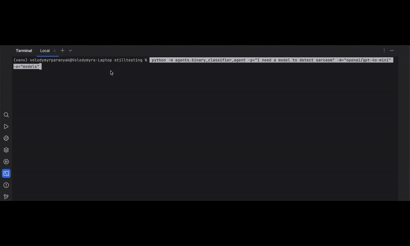

# WhiteLightning - LLM Distillation Tool

WhiteLightning is a powerful tool designed to distill large language models (LLMs) into lightweight, efficient classifiers. By leveraging advanced techniques, it simplifies the process of creating text classifiers that can run anywhere, from cloud environments to edge devices, using the ONNX format for cross-platform compatibility.

<p align="center">
   
</p>

<p align="center">
   
</p>

## What is LLM Distillation?

LLM distillation is the process of transforming large, complex language models into smaller, task-specific models. WhiteLightning focuses on binary and multiclass text classification, enabling users to classify text data into categories like "spam vs ham" or multiple classes with ease. This approach ensures high performance while significantly reducing computational requirements.

## Why ONNX?

WhiteLightning uses ONNX (Open Neural Network Exchange) to export trained models, making them deployable across a wide range of platforms and programming languages. With ONNX, you can run your models in Python, JavaScript, C++, Rust, and more, ensuring flexibility and scalability for your applications.

## Key Features

- **LLM Distillation**: Converts large language models into efficient binary or multiclass classifiers.
- **Cross-Platform Deployment**: Export models to ONNX for use in diverse environments.
- **Lightweight and Fast**: Optimized for performance with minimal resource usage.
- **Customizable**: Supports multiple machine learning frameworks, including TensorFlow, PyTorch, and Scikit-learn.

## How to Run WhiteLightning
To install WhiteLightning dependencies, use the following command:

```bash
pip install -r requirements/base.txt
```

Create .env file, example `.env.example` is provided in the repository.

Select the appropriate model for your task and follow the specific instructions in the corresponding documentation. The models are designed to be user-friendly, allowing you to quickly set up and start training your classifiers.

## Available Models

WhiteLightning currently supports the following classifiers:

1. **Binary Classifier**: Classifies text into two categories (e.g., "positive" vs "negative").
   [Read the Binary Classifier Documentation](BINARY_CLASSIFIER_AGENT.MD)

2. **Multiclass Classifier**: Classifies text into multiple categories.
   [Read the Multiclass Classifier Documentation](MULTICLASS_CLASSIFIER_AGENT.MD)

With WhiteLightning, you can easily train, evaluate, and deploy these models for your specific use case.

## Try It Yourself

Visit our [Playground](https://white-lightning-playground.vercel.app/) to experiment with WhiteLightning and see how it can be useful for you. You can test the available models and find some code snippets in supported languages.

## Contributing

We welcome contributions to WhiteLightning! If you have ideas for improvements, bug fixes, or new features, please submit a pull request or open an issue on our GitHub repository. Your feedback and contributions help us make WhiteLightning even better.

To contribute, please follow these steps:

1. Fork the repository.
2. Create a new branch for your feature or bug fix.
3. Set up your development environment using the provided instructions:
    ```bash
    pip install -r requirements/dev.txt

    pre-commit install

    detect-secrets scan > .secrets.baseline
    ```
