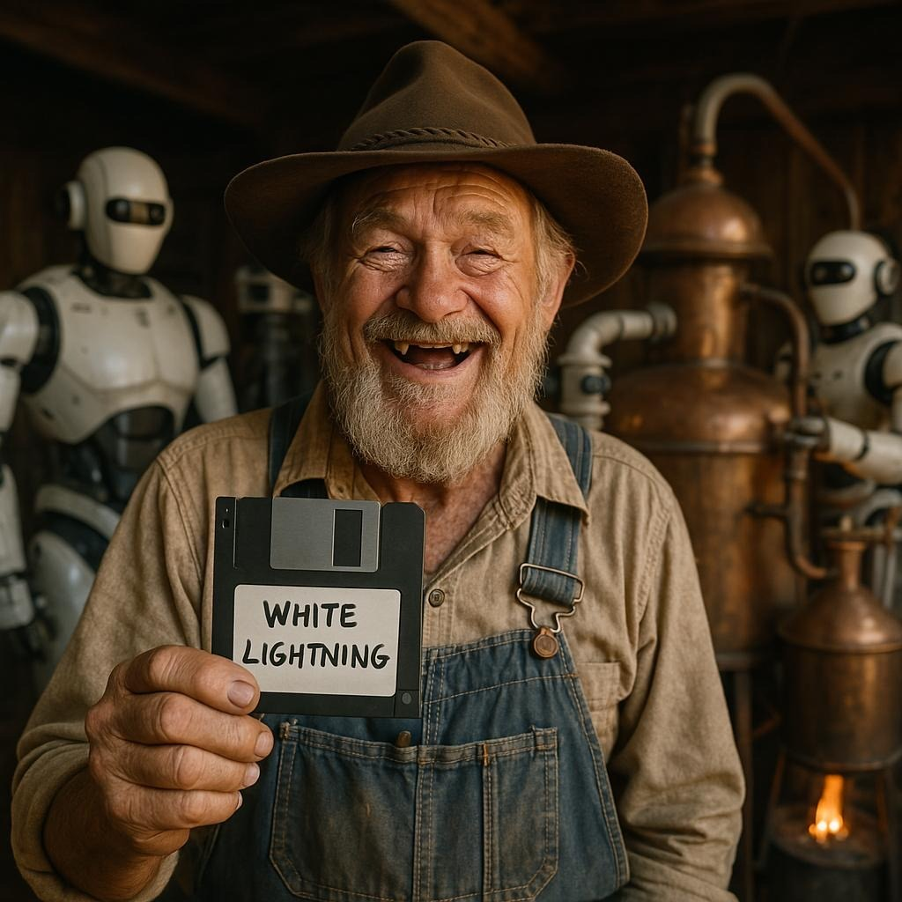
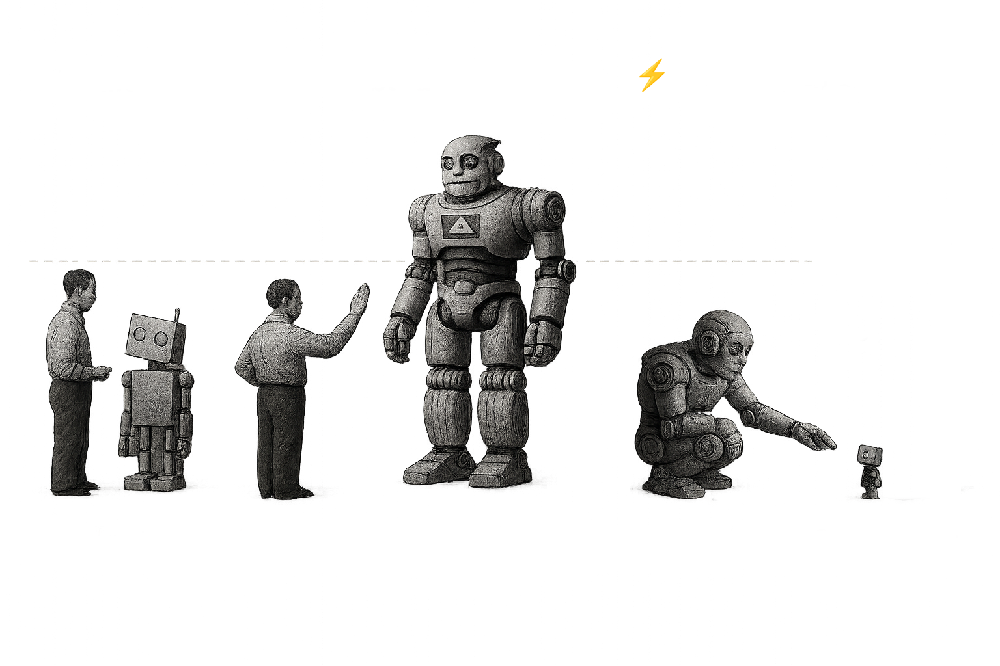

<p align="center">
  
  <h1 align="center">WhiteLightning</h1>
  <p align="center">
    The LLM Distillation Tool
  </p>
  <p align="center">
    <a href="https://whitelightning.ai"></a>
  </p>
</p>

<p align="center">
    <a href="https://github.com/whitelightning-ai/whitelightning/actions"></a>
    <a href="https://discord.com/invite/QDj8NS2yDt"></a>
    <a href="https://github.com/whitelightning-ai/whitelightning/stargazers"></a>
    <a href="https://github.com/whitelightning-ai/whitelightning/blob/main/LICENSE"></a>
</p>

**WhiteLightning** distills massive, state-of-the-art language models into lightweight, hyper-efficient text classifiers. It's a command-line tool that lets you create specialized models that run anywhere—from the cloud to the edge—using the universal **ONNX** format for maximum compatibility.

---

### What do we mean by "Distillation"?

We use large, powerful frontier models as "teachers" to train much smaller, task-specific "student" models. WhiteLightning automates this process for text classification, allowing you to create high-performance classifiers with a fraction of the computational footprint.

<p align="center">
  
</p>

### How are the models saved?

WhiteLightning exports every trained model to **ONNX (Open Neural Network Exchange)**. This standard format makes your models instantly portable. Run them natively in Python, JavaScript, C++, Rust, Java, and more, ensuring total flexibility for any project. Learn more at [onnx.ai](https://onnx.ai/).

---

### Key Features

* **Multiple Model Architectures**: Generate models for binary and multiclass classification with different activation functions.
* **Instant Cross-Platform Deployment**: Export to ONNX for use in any environment or language.
* **Lightweight & Incredibly Fast**: Optimized for high-speed inference with minimal resource consumption.
* **Framework Agnostic**: The final ONNX model has **zero dependencies** on TensorFlow or PyTorch. It's pure, portable compute.
* **Multilingual Support**: Generate training data and classifiers in a wide variety of languages.
* **Smart & Automatic**: Intelligently generates and refines prompts based on your classification task.

---

### 🚀 Quick Start

1.  Get an OpenRouter API key at **[openrouter.ai/settings/keys](https://openrouter.ai/settings/keys)**.

2.  Pull and run the Docker image. The command below mounts your current directory (`-v $(pwd):/app/models`) to save the model files locally.

    ```bash
    docker run \
        --rm \
        -v $(pwd):/app/models \
        -e OPEN_ROUTER_API_KEY="YOUR_OPEN_ROUTER_KEY_HERE" \
        ghcr.io/whitelightning-ai/whitelightning:latest \
        -p="Classify customer feedback as positive or negative sentiment" \
        --refinement-cycles=1 \
        --generate-edge-cases="true" \
        --lang="english"
    ```

3.  That's it! You'll see the generation process in your terminal.

    

    When it's finished, list the files in your directory (`ls -l`). You'll find all the assets for your new model, ready to go:


    ```sh
config.json                # Configuration and analysis
training_data.csv          # Generated training data
edge_case_data.csv         # Challenging test cases
model.onnx                 # ONNX model file
model_scaler.json          # StandardScaler parameters
model_vocab.json           # TF-IDF vocabulary
    ```

See our **[Complete Documentation](https://whitelightning.ai)** for guides on how to use these files in your language of choice (C++, Rust, iOS, Android, and more).

---

### 💡 Making It Your Own: Example Prompts

The power of WhiteLightning is the `-p` (prompt) argument. You can create a classifier for almost anything just by describing it. Here are some ideas to get you started:

* **Spam Filter**:
    `-p="Classify emails as 'spam' or 'not_spam'"`

* **Topic Classifier**:
    `-p="Determine if a news headline is about 'tech', 'sports', 'world_news', or 'finance'"`

* **Toxicity Detector**:
    `-p="Detect whether a user comment is 'toxic' or 'safe'"`

* **Urgency Detection**:
    `-p="Categorize a support ticket's urgency as 'high', 'medium', or 'low'"`
    
* **Intent Recognition**:
    `-p="Classify the user's intent as 'book_flight', 'check_status', or 'customer_support'"`

The possibilities are endless. For more inspiration and advanced prompt engineering techniques, check out our **[Complete Documentation](https://whitelightning.ai)**.

---

### Advanced Setup

Want to build from source or customize the Docker image? Check out the **[Local Setup Guide](docs/docker/README.md)**.

### Contributing

We welcome all contributions! The best way to start is by joining our **[Discord Server](https://discord.com/invite/QDj8NS2yDt)** and chatting with the team. We're happy to help you get started.

### License

This project is licensed under the GPLv3 License - see the [LICENSE](LICENSE) file for details.
